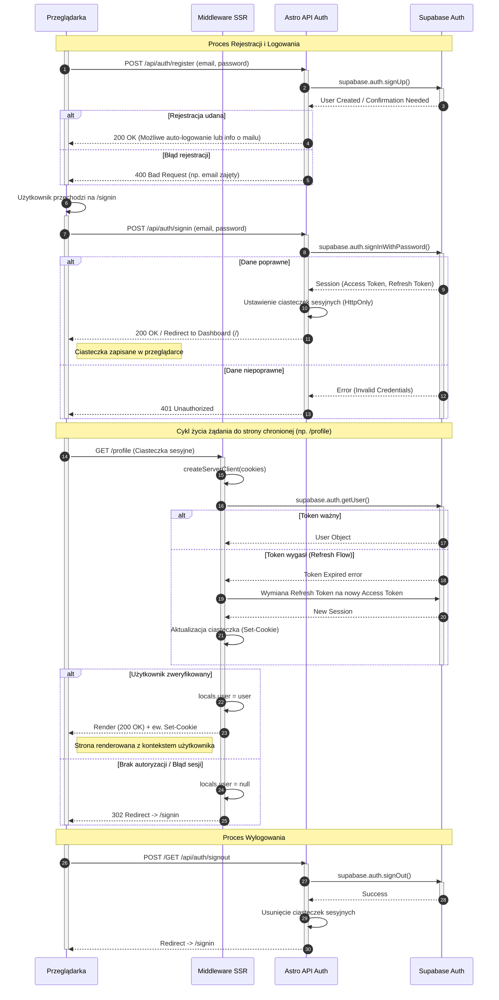

<authentication_analysis>
1. **Przepływy autentykacji**:
   - **Rejestracja**: Użytkownik tworzy konto przez formularz `RegisterForm` -> `POST /api/auth/register` -> `Supabase Auth`.
   - **Logowanie**: Użytkownik loguje się przez `LoginForm` -> `POST /api/auth/signin` -> `Supabase Auth` zwraca sesję -> Serwer ustawia ciasteczka HttpOnly.
   - **Dostęp do stron chronionych**: Middleware przechwytuje żądanie -> Weryfikuje token (SSR) -> Odświeża token w razie potrzeby -> `context.locals`.
   - **Wylogowanie**: Wywołanie `/api/auth/signout` -> Usunięcie sesji w Supabase i wyczyszczenie ciasteczek.
   - **Reset hasła**: Inicjacja resetu -> Link magiczny -> Ustawienie nowego hasła.

2. **Aktorzy i interakcje**:
   - **Przeglądarka**: Klient użytkownika, przechowuje ciasteczka sesyjne.
   - **Middleware**: Pierwsza warstwa obrony na serwerze Astro (SSR). Zarządza klientem Supabase i weryfikuje użytkownika.
   - **Astro API**: Endpointy serwerowe (`src/pages/api/auth/*`) realizujące logikę biznesową.
   - **Supabase Auth**: Zewnętrzny serwis autentykacji i bazy danych.

3. **Procesy weryfikacji i odświeżania**:
   - **Weryfikacja**: Odbywa się przy każdym żądaniu w Middleware przy użyciu `supabase.auth.getUser()`, co zapewnia bezpieczeństwo po stronie serwera.
   - **Odświeżanie tokena**: Biblioteka `@supabase/ssr` automatycznie obsługuje odświeżanie tokena (`refresh_token`) w Middleware, aktualizując ciasteczko w odpowiedzi (`Set-Cookie`), jeśli token dostępu wygasł.

4. **Kroki autentykacji** (skrót):
   - Żądanie strony -> Middleware sprawdza ciasteczka -> Jeśli brak/błąd -> Przekierowanie do `/signin`.
   - Logowanie -> API weryfikuje dane w Supabase -> Zwraca ciasteczka sesyjne.
   - Sesja aktywna -> Middleware wpuszcza żądanie -> Aplikacja ma dostęp do `user` w `context.locals`.
</authentication_analysis>

<mermaid_diagram>

</mermaid_diagram>
