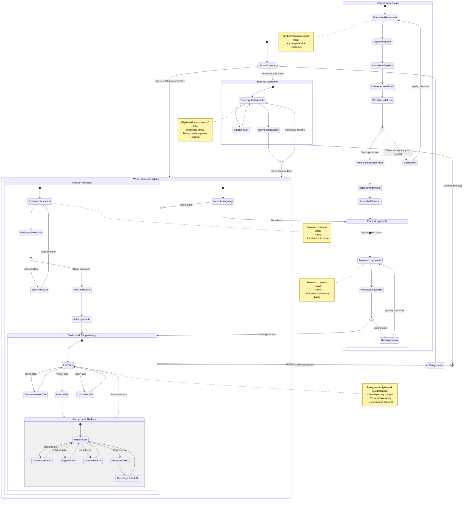

# Diagram Podróży Użytkownika - Moduł Logowania i Rejestracji

Ten diagram przedstawia pełną podróż użytkownika w aplikacji 10x-cards, obejmującą:
- Pracę bez logowania (dane lokalne)
- Proces rejestracji
- Proces logowania
- Odzyskiwanie hasła
- Zarządzanie taliami i fiszkami dla zalogowanych użytkowników

## Opis głównych ścieżek

### 1. Praca bez logowania (US-003)
- Użytkownik może natychmiast rozpocząć pracę bez tworzenia konta
- Talie i fiszki przechowywane lokalnie w przeglądarce
- Brak dostępu do funkcji synchronizacji i przywracania wersji
- Możliwość późniejszego zalogowania/rejestracji

### 2. Rejestracja (US-001)
- Dedykowana strona z formularzem rejestracji
- Wymagane pola: email, hasło, potwierdzenie hasła
- Walidacja formatu email i zgodności haseł
- Po sukcesie: automatyczne logowanie i przekierowanie do Dashboard

### 3. Logowanie (US-002)
- Dedykowana strona logowania
- Wymagane: email i hasło
- Link do odzyskiwania hasła
- Obsługa błędów walidacji z możliwością ponownej próby
- Po sukcesie: przekierowanie do Dashboard

### 4. Odzyskiwanie hasła (US-003)
- Formularz z polem email
- Wysyłka emaila z tokenem resetującym
- Weryfikacja tokenu (ważność czasowa)
- Formularz nowego hasła
- Po sukcesie: przekierowanie do logowania

### 5. Dashboard zalogowanego użytkownika (US-003, US-004, US-005, US-006)
- Lista wszystkich talii użytkownika
- Tworzenie, edycja, usuwanie talii
- Zarządzanie fiszkami (CRUD)
- Generowanie fiszek przy użyciu AI
- Przywracanie poprzednich wersji
- Możliwość wylogowania

## Punkty decyzyjne

1. **Zalogowany vs Niezalogowany** - różne możliwości funkcjonalne
2. **Logowanie vs Rejestracja** - wybór typu autentykacji
3. **Walidacja danych** - poprawne/niepoprawne dane formularza
4. **Token resetujący** - ważny/nieważny/wygasły
5. **Kontynuacja lokalnie** - użytkownik decyduje czy chce się zalogować

## Zabezpieczenia (US-008)

- API weryfikuje zgodność ID użytkownika z sesją
- Dane talii i fiszek są prywatne dla każdego użytkownika
- Tokeny resetowania hasła mają ograniczoną ważność czasową
- Sesje użytkownika są bezpiecznie zarządzane
