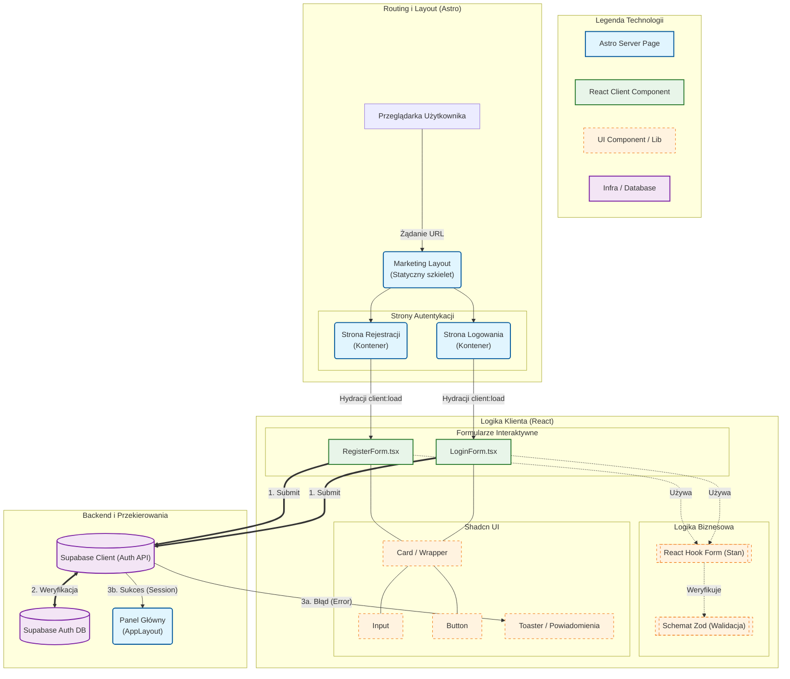

# Diagram Architektury UI - Moduł Autentykacji

Poniższy diagram przedstawia architekturę komponentów UI oraz przepływ danych dla modułów logowania i rejestracji w aplikacji 10x-cards. Wizualizacja obejmuje podział na warstwę serwerową (Astro), kliencką (React) oraz infrastrukturę backendową.

## Opis komponentów

### Warstwa Layoutu (Astro)
*   **MarketingLayout.astro**: Główny szablon dla stron publicznych. Zawiera nagłówek, stopkę i style globalne (CSS). Odpowiada za initial paint.
*   **Strony logowania/rejestracji**: Pliki `.astro` działające jako kontenery. Są renderowane na serwerze i dostarczają "szkielet" strony, w który hydrowane są komponenty React.

### Warstwa Logiki Klienta (React)
*   **LoginForm / RegisterForm**: Główne komponenty "smart". Obsługują:
    *   Zarządzanie stanem formularza (inputy użytkownika).
    *   Walidację w czasie rzeczywistym i przy wysyłce (poprzez Zod).
    *   Komunikację z `supabase.client.ts`.
    *   Obsługę stanów ładowania (loading) i błędów.
*   **Shadcn UI**: Zestaw komponentów prezentacyjnych (`dumb components`), które zapewniają spójny wygląd (Input, Button, Card).

### Warstwa Infrastruktury
*   **Supabase Client**: Singleton odpowiedzialny za bezpieczną komunikację z API autentykacji Supabase.
*   **Toaster**: Globalny komponent do wyświetlania komunikatów (np. "Złe hasło", "Konto utworzone"), sterowany zdarzeniami z formularzy.
